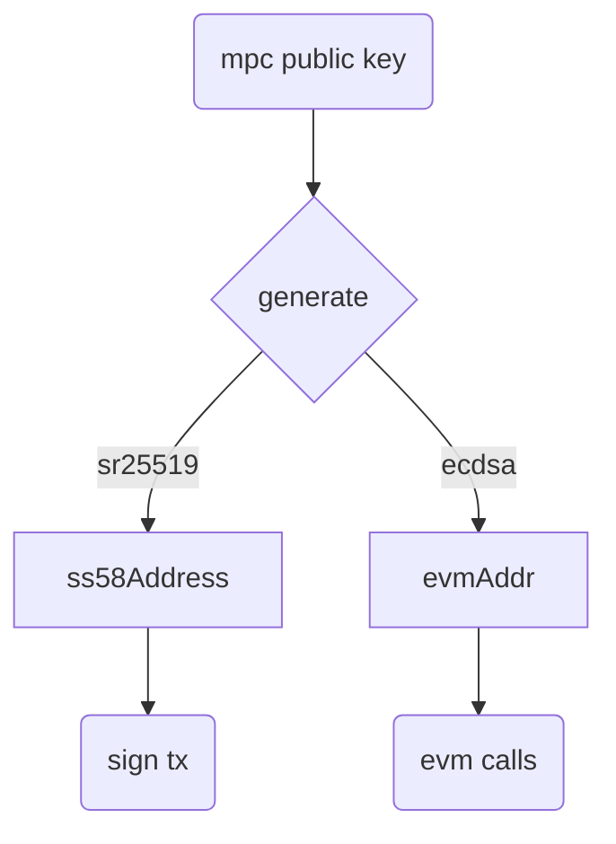

# reef router

## github
https://github.com/anyswap/CrossChain-Router/tree/feature/reef-substrate

## router contract
https://github.com/anyswap/anyswap-v1-core

## account mechanism

```mermaid
graph TB
    begin(mpc public key)--> IsRemaining{"generate"}
    IsRemaining --sr25519-->reefAddr[ss58Address]--> sign(sign tx)
    IsRemaining --> |ecdsa|evmAddr[evmAddr]--> interaction(evm calls)
```
