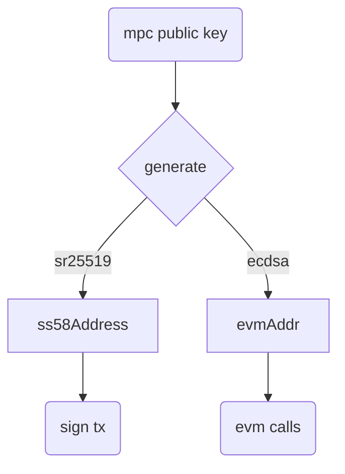
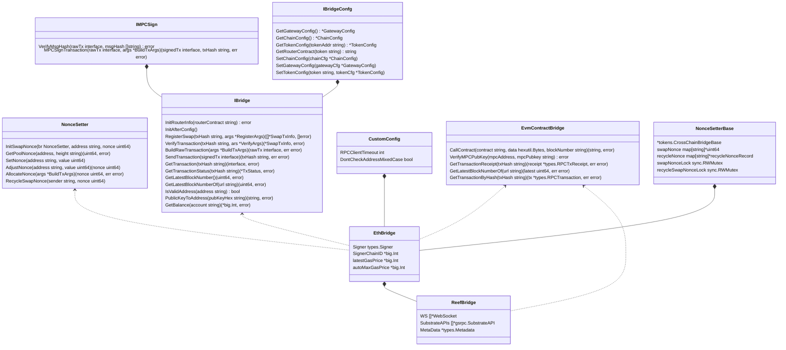
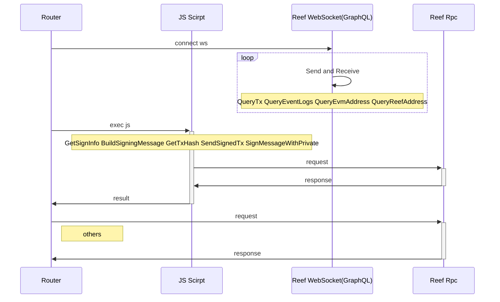

# Reef 

## Reef Docs
https://docs.reef.io/docs/users/introduction/

- Metamask
  https://docs.reef.io/docs/users/extension/
- web3
  https://github.com/reef-defi/evm-provider.js
- Truffle/Hardhat
  https://github.com/reef-defi/hardhat-reef
- Remix IDE
  https://remix.reefscan.com/
- Etherscan
  https://reefscan.com/
- GraphQL
https://github.com/reef-defi/reef-explorer/tree/develop/db/hasura/metadata/databases/reefexplorer/tables

## Router Github
https://github.com/anyswap/CrossChain-Router/tree/feature/reef-substrate

## Router Contract
Reef support evm contract
https://github.com/anyswap/anyswap-v1-core


## Account Mechanism

## Class Diagram

## Sequence Diagram 



# Tools
- GetReefChainID
  ```
  go run tokens/reef/tools/getStubChainID/main.go -h
  ```
- GetReefAddress
   ```
  go run tokens/reef/tools/getReefAddress/main.go -h
  ```